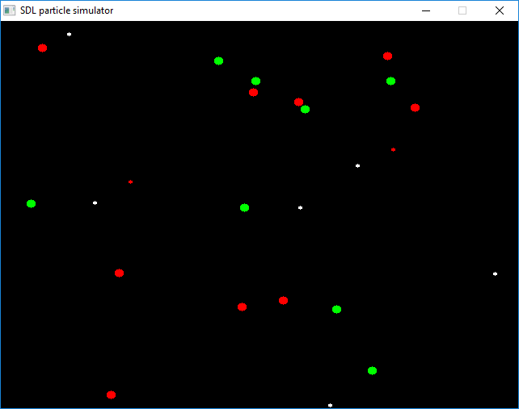

# particles
Basic C++/SDL particle simulator engine

I've written this program as a homework for my C++ course.

There are green, red, and white particles. The rules are:
- Green and red particles repell themself
- Green and red particles attract each other
- Green particles colliding with each other create a white particle
- White particle colliding with a green or red particle divides it to two half-sized particles

Enjoy!

